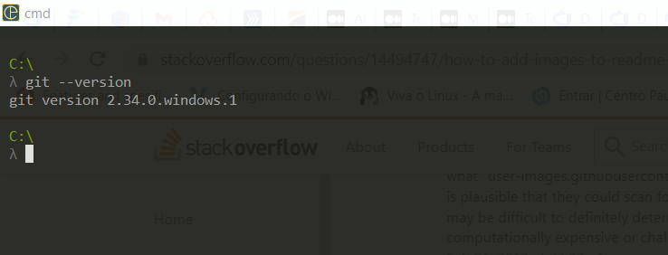

# Git init

## O que é git?
 *"O Git é um projeto de código aberto maduro e com manutenção ativa desenvolvido em 2005 por Linus Torvalds, o famoso criador do kernel do sistema operacional Linux."*
 [Atlassian](https://www.atlassian.com/br/git/tutorials/what-is-git)

Possuí uma arquitetura distrubuida, onde cada desenvolvedor possuí uma cópia completa de todas as alterações no repositório, diferente de alguns versionadores (CVS ou Subversion).

## Instalando o GIT no Windows

1. Baixe o instalador mais recente do [Git for Windows](https://gitforwindows.org/).
2. Como console, prefiro o [cmder](https://cmder.app/) invés do propmt do windows. 
3. Com o cmder aberto, execute git --version
   * Esse será o resultado, caso tenha instalado com sucesso.
    

4. Execute os comandos a seguir para configurar o nome do usuário e e-mail do Git, substituindo o nome "Michel Balthazar" pelo seu próprio. Essas informações vão ser associadas a quaisquer commits que você criar:
   >`git config --global user.name "Michel Balthazar" $ git config --global user.email "michel@balthazar.com.br"`

# Criar Repositórios
## git init [nome-do-projeto]
Cria um novo repositório local com o nome de projecto especificado.
> `git init`

## git clone [url]
Faz download de um projeto/repositório, incluindo toda a sua história.
> `git clone git clone https://github.com/michelbalthazar/git-init.git`

# Fazer e Ver Alterações 

## git status
Lista todos os arquivos modificados no projecto atual.
> `git status`

## git add [ARQUIVO]
Adiciona um arquivo à área de preparação (stage) para que possa ser incluído
em commits (staged).
> `git add README.md`

ou para adicionar todos os arquivos de uma vez:
> `git add .` / `git add *`

## git reset [path/ARQUIVO]
Remove o arquivo da área de preparação (staged).
> `git reset path/nome-do-arquivo`

ou para remover todos os arquivos de uma vez da preparação (staged)
> `git reset *`

## git commit -m ""
Guarda as alterações preparadas (staged) permanentemente no histórico de
versões (para cada commit é gerado um hash de identificação).
> `git commit -m "implementando validação de cpf"`

# Branching (ramificação de trabalho isolada)

## git branch
Lista todas as branches locais no repositório atual
> `git branch`

## git branch [nome-da-branch]
Cria uma nova branch
> `git branch features/implementando-nova-feature`

## git branch -d  [nome-da-branch]
Deleta uma branch do repositório local
> `git branch -d features/implementando-nova-feature`

## git branch -m [nome-atual-da-branch] [nome-novo-da-branch]
Renomeia a branch.
> `git branch -m nome-atual nome-novo`

## git checkout [nome-da-branch]
Muda para a branch especificada e atualiza o diretório de trabalho.
> `git checkout development`

## git checkout -b [nome-da-branch]
Cria uma nova branch e em seguida muda para a nova branch automaticamente.
> `git checkout development`

# Guardar Alterações Temporariamente

## git stash
Armazena temporariamente todos os arquivos modificados em um pacote.
> `git stash`

## git stash list
Lista todos os pacotes de alterações no stash.
> `git stash list`
## git stash pop
Restaura o último pacote de stash da lista.
> `git stash pop`

## git stash apply stash@{2}
Restaura um pacote de stash específico.
> `git stash apply stash@{1}`

## git stash drop stash@{2}
Remove um pacote de stash específico.
> `git stash drop stash@{2}`

## git stash clear
Limpa toda lista de stash.
> `git stash clear`

# Alterando e Sincronizando repositório remotos e locais

## git remote add [nome] [url]
Adiciona um novo controle remoto, de um projeto já existente.
> `git remote add origin https://github.com/michelbalthazar/git-init.git`

## git fetch [remote]
Faz download de todo o histórico de um repositório remoto.
> `git fetch origin`

## git push
Envia todos os commits da branch local para repositório remoto.
> `git push origin features/implementando-nova-feature`

## git pull origin [nome-da-branch]
Download e merge num só comando. Igual a executar: git fetch e git merge
> `git pull origin features/implementando-nova-feature`

## git merge [nome-da-branch]
Combina o histórico da branch especificada com a branch atual.
> `git merge features/implementando-nova-feature`

# Desfazendo commits

## git revert [commit-hash]
Reverte as alterações de um commit específico, ele cria um novo commit com os dados revertido/alterado. 
> `git revert 80976e3b976b400f0cf5019f592bd8c098784168`

## git revert HEAD^2
Faz a mesma coisa que o comando de cima, porém revert os últimos 2 commits. 

## git reset --soft <commitId>
Volta todas as alterações do do commit especificado para o estado de preparação (staged) e não mantém o histórico do commit desfeito. 

## git reset --soft HEAD^3
Faz a mesma coisa que o comando de cima, porém reseta/desfaz os últimos 3 commits. 

## git ignore
Utilizado para informar quais arquivos não será monitorado pelo GIT, logo esses arquivos não serão enviado para para o repositório remoto. Normalmente são arquivos de configuração, auto gerados da linguagem em questão. [Gere aqui seu gitignore](https://www.gitignore.io)